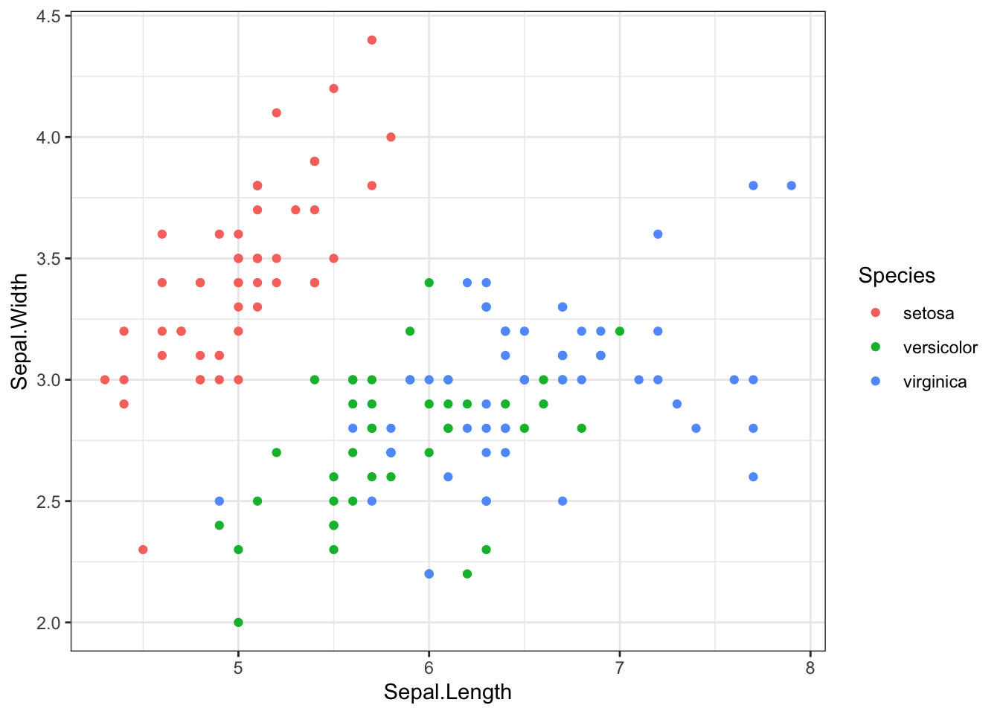
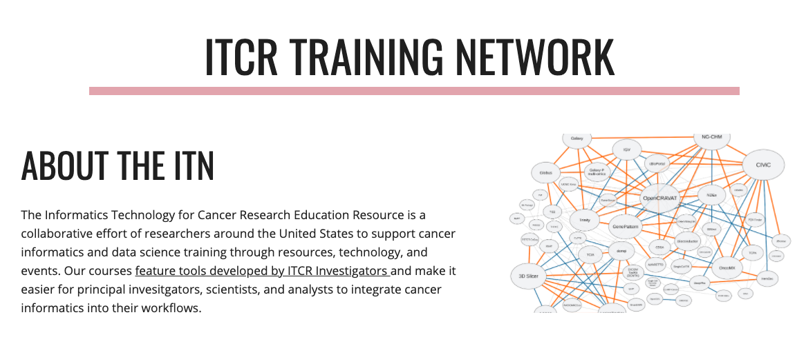

## Learning Objectives

This chapter will cover:  

- {You can use https://www.bu.edu/cme/forms/RSS_forms/tips_for_writing_objectives.pdf to define some learning objectives here}
- {Another learning objective}

## Libraries

For this chapter, we'll need the following packages attached. 


```r
library(here)
```

```
## here() starts at /Users/carriewright/Documents/GitHub/ITCR/templates/testing_template
```

```r
library(ggplot2)
library(magrittr)
```

# Topic of Section

Text Text

## Subtopic

Text Text 

### Code examples


```r
output_dir <- "code_output"
if (!dir.exists(output_dir)) {
  dir.create(output_dir)
}
```


```r
iris %>%
  ggplot(aes(Sepal.Length, Sepal.Width, color = Species)) +
  geom_point() +
  theme_bw()
```




```r
ggsave(file.path(output_dir, "test_ggplot2.png"))
```

```
## Saving 7 x 5 in image
```

### Image examples




### Video example


### Citation examples

We can put citations at the end of a sentence like this [@bookdown2016]. 

In text, we can put citations like this @bookdown2016. 

## Print out session info


```r
devtools::session_info()
```

```
## ─ Session info ───────────────────────────────────────────────────────────────
##  setting  value                       
##  version  R version 4.0.3 (2020-10-10)
##  os       macOS Mojave 10.14.6        
##  system   x86_64, darwin17.0          
##  ui       X11                         
##  language (EN)                        
##  collate  en_US.UTF-8                 
##  ctype    en_US.UTF-8                 
##  tz       America/New_York            
##  date     2021-04-14                  
## 
## ─ Packages ───────────────────────────────────────────────────────────────────
##  package     * version date       lib source                            
##  assertthat    0.2.1   2019-03-21 [1] CRAN (R 4.0.0)                    
##  bookdown      0.21    2020-10-13 [1] CRAN (R 4.0.2)                    
##  bslib         0.2.4   2021-01-25 [1] CRAN (R 4.0.2)                    
##  cachem        1.0.1   2021-01-21 [1] CRAN (R 4.0.2)                    
##  callr         3.5.1   2020-10-13 [1] CRAN (R 4.0.2)                    
##  cli           2.3.1   2021-02-23 [1] CRAN (R 4.0.2)                    
##  colorspace    2.0-0   2020-11-11 [1] CRAN (R 4.0.2)                    
##  crayon        1.4.1   2021-02-08 [1] CRAN (R 4.0.3)                    
##  DBI           1.1.1   2021-01-15 [1] CRAN (R 4.0.2)                    
##  desc          1.3.0   2021-03-05 [1] CRAN (R 4.0.2)                    
##  devtools      2.3.2   2020-09-18 [1] CRAN (R 4.0.2)                    
##  digest        0.6.27  2020-10-24 [1] CRAN (R 4.0.2)                    
##  dplyr         1.0.4   2021-02-02 [1] CRAN (R 4.0.2)                    
##  ellipsis      0.3.1   2020-05-15 [1] CRAN (R 4.0.0)                    
##  evaluate      0.14    2019-05-28 [1] CRAN (R 4.0.0)                    
##  fansi         0.4.2   2021-01-15 [1] CRAN (R 4.0.2)                    
##  farver        2.0.3   2020-01-16 [1] CRAN (R 4.0.0)                    
##  fastmap       1.1.0   2021-01-25 [1] CRAN (R 4.0.2)                    
##  fs            1.5.0   2020-07-31 [1] CRAN (R 4.0.2)                    
##  generics      0.1.0   2020-10-31 [1] CRAN (R 4.0.2)                    
##  ggplot2     * 3.3.3   2020-12-30 [1] CRAN (R 4.0.2)                    
##  glue          1.4.2   2020-08-27 [1] CRAN (R 4.0.2)                    
##  gtable        0.3.0   2019-03-25 [1] CRAN (R 4.0.0)                    
##  here        * 1.0.1   2020-12-13 [1] CRAN (R 4.0.2)                    
##  highr         0.8     2019-03-20 [1] CRAN (R 4.0.0)                    
##  htmltools     0.5.1.1 2021-01-22 [1] CRAN (R 4.0.2)                    
##  jquerylib     0.1.3   2020-12-17 [1] CRAN (R 4.0.2)                    
##  jsonlite      1.7.2   2020-12-09 [1] CRAN (R 4.0.2)                    
##  knitr         1.31    2021-01-27 [1] CRAN (R 4.0.2)                    
##  labeling      0.4.2   2020-10-20 [1] CRAN (R 4.0.2)                    
##  lifecycle     1.0.0   2021-02-15 [1] CRAN (R 4.0.2)                    
##  magrittr    * 2.0.1   2020-11-17 [1] CRAN (R 4.0.2)                    
##  memoise       2.0.0   2021-01-26 [1] CRAN (R 4.0.2)                    
##  munsell       0.5.0   2018-06-12 [1] CRAN (R 4.0.0)                    
##  pillar        1.5.1   2021-03-05 [1] CRAN (R 4.0.2)                    
##  pkgbuild      1.2.0   2020-12-15 [1] CRAN (R 4.0.2)                    
##  pkgconfig     2.0.3   2019-09-22 [1] CRAN (R 4.0.0)                    
##  pkgload       1.1.0   2020-05-29 [1] CRAN (R 4.0.0)                    
##  prettyunits   1.1.1   2020-01-24 [1] CRAN (R 4.0.0)                    
##  processx      3.4.5   2020-11-30 [1] CRAN (R 4.0.2)                    
##  ps            1.5.0   2020-12-05 [1] CRAN (R 4.0.2)                    
##  purrr         0.3.4   2020-04-17 [1] CRAN (R 4.0.0)                    
##  R6            2.5.0   2020-10-28 [1] CRAN (R 4.0.2)                    
##  remotes       2.2.0   2020-07-21 [1] CRAN (R 4.0.2)                    
##  rlang         0.4.10  2020-12-30 [1] CRAN (R 4.0.2)                    
##  rmarkdown     2.6.6   2021-02-08 [1] Github (rstudio/rmarkdown@de0e2ec)
##  rprojroot     2.0.2   2020-11-15 [1] CRAN (R 4.0.2)                    
##  sass          0.3.1   2021-01-24 [1] CRAN (R 4.0.2)                    
##  scales        1.1.1   2020-05-11 [1] CRAN (R 4.0.0)                    
##  sessioninfo   1.1.1   2018-11-05 [1] CRAN (R 4.0.2)                    
##  stringi       1.5.3   2020-09-09 [1] CRAN (R 4.0.2)                    
##  stringr       1.4.0   2019-02-10 [1] CRAN (R 4.0.0)                    
##  testthat      3.0.1   2020-12-17 [1] CRAN (R 4.0.2)                    
##  tibble        3.1.0   2021-02-25 [1] CRAN (R 4.0.2)                    
##  tidyselect    1.1.0   2020-05-11 [1] CRAN (R 4.0.0)                    
##  usethis       2.0.1   2021-02-10 [1] CRAN (R 4.0.2)                    
##  utf8          1.1.4   2018-05-24 [1] CRAN (R 4.0.0)                    
##  vctrs         0.3.6   2020-12-17 [1] CRAN (R 4.0.2)                    
##  withr         2.4.1   2021-01-26 [1] CRAN (R 4.0.2)                    
##  xfun          0.21    2021-02-10 [1] CRAN (R 4.0.2)                    
##  yaml          2.2.1   2020-02-01 [1] CRAN (R 4.0.0)                    
## 
## [1] /Library/Frameworks/R.framework/Versions/4.0/Resources/library
```

